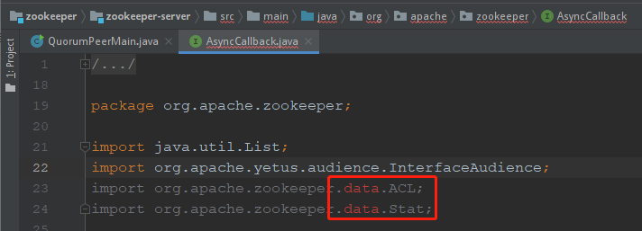

### Zookeeper介绍
  
  Apache ZooKeeper是Apache软件基金会的一个软件项目，他为大型分布式计算提供开源的分布式配置服务、同步服务和命名注册。ZooKeeper曾经是Hadoop的一个子项目，但现在是一个独立的顶级项目。
  
### 下载与安装
   
   下载地址：https://zookeeper.apache.org/

#### 解压 
   
   windows: 使用解压工具解压 
   
   linux: tar -zxvf apache-zookeeper-3.6.1-bin.tar.gz

#### 配置
   
   进入到conf文件夹，找到zoo_sample.cfg文件，并复制为zoo.cfg 
```
tickTime=2000

initLimit=10

syncLimit=5

dataDir=/tmp/zookeeper

clientPort=2181
```

#####  配置文件解释
   
   tickTime：Zookeeper 服务器之间或客户端与服务器之间维持心跳的时间间隔，也就是每个 tickTime 时间就会发送一个心跳。tickTime以毫秒为单位。该参数用来定义心跳的间隔时间，zookeeper的客户端和服务端之间也有和web开发里类似的session的概念，而zookeeper里最小的session过期时间就是tickTime的两倍。
   
   initLimit：Follower在启动过程中，会从Leader同步所有最新数据，然后确定自己能够对外服务的起始状态。Leader允许F在 initLimit 时间内完成这个工作。通常情况下，我们不用太在意这个参数的设置。如果ZK集群的数据量确实很大了，F在启动的时候，从Leader上同步数据的时间也会相应变长，因此在这种情况下，有必要适当调大这个参数了。默认为10。
   
   syncLimit：在运行过程中，Leader负责与ZK集群中所有机器进行通信，例如通过一些心跳检测机制，来检测机器的存活状态。如果L发出心跳包在syncLimit之后，还没有从F那里收到响应，那么就认为这个F已经不在线了。注意：不要把这个参数设置得过大，否则可能会掩盖一些问题。
   
   dataDir：存储快照文件snapshot的目录。默认情况下，事务日志也会存储在这里。建议同时配置参数dataLogDir, 事务日志的写性能直接影响zk性能。
   
   dataLogDir: 存储日志文件目录
   
   clientPort：客户端连接服务器的端口
   
   maxClientCnxns
   
   autopurge.snapRetainCount
   
   autopurge.purgeInterval

####  配置环境变量 
``` 
    // 打开环境变量文件
    # vim /etc/profile
    
    // 添加环境变量
    export ZOOKEEPER_HOME=/usr/app/zookeeper-3.4.14
    export PATH=$ZOOKEEPER_HOME/bin:$PATH
   
    // 生效 
    # source /etc/profile
```
#### 启动服务端
   
   window:  点击  zkServer.cmd
   
   linux：   zkServer.sh 或者 ./zookeeper/zkServer.sh  或者 zookeeper/zkServer.sh 

#### 使用客户端 
   
   window:  点击  zkCli.cmd

   运行成功会显示启动日志，最后可以在命令行内看到如下控制台
   
   

###  伪集群环境搭建

#### 1.复制配置文件
```
cd {zookeeperurl}/conf/
> cp zoo.cfg zoo1.cfg
> cp zoo.cfg zoo2.cfg
> cp zoo.cfg zoo3.cfg
```

#### 5.2 创建数据以及日志文件目录
```
> mkdir -p /zookeeper/data_1
> mkdir -p /zookeeper/data_2
> mkdir -p /zookeeper/data_3
```
```
> mkdir -p /zookeeper/logs_1
> mkdir -p /zookeeper/logs_2
> mkdir -p /zookeeper/logs_3
```

#### 5.3 创建myid文件
```
> echo "1" > /zookeeper/data_1/myid
> echo "2" > /zookeeper/data_2/myid
> echo "3" > /zookeeper/data_3/myid
```

#### 5.4 修改配置文件
```
zoo1.cfg

tickTime=2000
initLimit=10
syncLimit=5
dataDir=/zookeeper/data_1
clientPort=2181
dataLogDir=/zookeeper/logs_1
# server.x中的x和myid中的一致，第一个端口用户Leader和Learner之间的同步，第二个端口用于选举过程中的投票通信
server.1=localhost:2887:3887 
server.2=localhost:2888:3888
server.3=localhost:2889:3889
```

```
zoo2.cfg

tickTime=2000
initLimit=10
syncLimit=5
dataDir=/zookeeper/data_2
clientPort=2182
dataLogDir=/zookeeper/logs_2
server.1=localhost:2887:3887
server.2=localhost:2888:3888
server.3=localhost:2889:3889
```

```
zoo3.cfg

tickTime=2000
initLimit=10
syncLimit=5
dataDir=/zookeeper/data_3
clientPort=2183
dataLogDir=/zookeeper/logs_3
server.1=localhost:2887:3887
server.2=localhost:2888:3888
server.3=localhost:2889:3889
```

#### 5.5 启动集群

```
> zkServer.sh start {zookeeperUrl}/zookeeper-3.6.1/conf/zoo1.cfg 
> zkServer.sh start {zookeeperUrl}/zookeeper-3.6.1/conf/zoo2.cfg 
> zkServer.sh start {zookeeperUrl}/zookeeper-3.6.1/conf/zoo3.cfg
```

#### 5.6 验证

```
> zkServer.sh status {zookeeperUrl}zookeeper-3.4.12/conf/zoo1.cfg 
> zkServer.sh status {zookeeperUrl}zookeeper-3.4.12/conf/zoo2.cfg 
> zkServer.sh status {zookeeperUrl}zookeeper-3.4.12/conf/zoo3.cfg
```
   
   可以看到server1：Mode: follower
   
   可以看到server2：Mode: leader
   
   可以看到server3：Mode: follower
   
   打开三个命令行客户端分别连上三个server
   
```
> zkCli.sh -server localhost:2181
> zkCli.sh -server localhost:2182
> zkCli.sh -server localhost:2183
```

   连上之后，在三个客户端执行ls /可以分别查到3个server的当前目录结构都是一样的。
   在server1上执行命令create /firstNode "server1创建的"，执行完成后可以看到在server2、server3都能同步被创建成功。

### 集群的角色

   领导者（Leader) : 负责进行投票的发起和决议，最终更新状态。
   
   跟随者（Follower）: Follower用于接收客户请求并返回客户结果。参与Leader发起的投票。
   
   观察者（observer）: Oberserver可以接收客户端连接，将写请求转发给leader节点。但是Observer不参加投票过程，只是同步leader的状态。Observer为系统扩展提供了一种方法。
   
   学习者 ( Learner ) : 和leader进行状态同步的server统称Learner，上述Follower和Observer都是Learner。

#### 为什么要有Observer

    节点配置中增加
    
    peerType=observer
    
    servers列表中增加：
    
    server.4=localhost:2890:3890:observer
   
   ZooKeeper服务中的每个Server可服务于多个Client，并且Client可连接到ZK服务中的任一台Server来提交请求。若是读请求，则由每台Server的本地副本数据库直接响应。若是改变Server状态的写请求，需要通过一致性协议来处理，这个协议就是我们前面介绍的Zab协议。
   简单来说，Zab协议规定：来自Client的所有写请求，都要转发给ZK服务中唯一的Server—Leader，由Leader根据该请求发起一个Proposal。然后，其他的Server对该Proposal进行投票。之后，Leader对投票进行收集，当投票数量过半时Leader会向所有的Server发送一个通知消息。最后，当Client所连接的Server收到该消息时，会把该操作更新到内存中并对Client的写请求做出回应。
   
   ZooKeeper 服务器在上述协议中实际扮演了两个职能。它们一方面从客户端接受连接与操作请求，另一方面对操作结果进行投票。这两个职能在 ZooKeeper集群扩展的时候彼此制约。例如，当我们希望增加 ZK服务中Client数量的时候，那么我们就需要增加Server的数量，来支持这么多的客户端。然而，从Zab协议对写请求的处理过程中我们可以发现，增加服务器的数量，则增加了对协议中投票过程的压力。因为Leader节点必须等待集群中过半Server响应投票，于是节点的增加使得部分计算机运行较慢，从而拖慢整个投票过程的可能性也随之提高，写操作也会随之下降。这正是我们在实际操作中看到的问题——随着 ZooKeeper 集群变大，写操作的吞吐量会下降。
   所以，我们不得不，在增加Client数量的期望和我们希望保持较好吞吐性能的期望间进行权衡。要打破这一耦合关系，我们引入了不参与投票的服务器，称为 Observer。 Observer可以接受客户端的连接，并将写请求转发给Leader节点。但是，Leader节点不会要求 Observer参加投票。相反，Observer不参与投票过程，仅仅在上述第3歩那样，和其他服务节点一起得到投票结果。
   
   这个简单的扩展，给 ZooKeeper 的可伸缩性带来了全新的镜像。我们现在可以加入很多 Observer 节点，而无须担心严重影响写吞吐量。但他并非是无懈可击的，因为协议中的通知阶段，仍然与服务器的数量呈线性关系。但是，这里的串行开销非常低。因此，我们可以认为在通知服务器阶段的开销无法成为主要瓶颈。

#### Zookeeper中的CAP
   
   Zookeeper至少满足了**CP**，牺牲了可用性，比如现在集群中有Leader和Follower两种角色，那么当其中任意一台服务器挂掉了，都要重新进行选举，在选举过程中，集群是不可用的，这就是牺牲的可用性。
   
   但是，如果集群中有Leader、Follower、Observer三种角色，那么如果挂掉的是Observer，那么对于集群来说并没有影响，集群还是可以用的，只是Observer节点的数据不同了，从这个角度考虑，Zookeeper又是牺牲了一致性，满足了**AP**

### Zookeeper能做什么？
   
#### 统一命名服务
   
   命名服务也是分布式系统中比较常见的一类场景。在分布式系统中，通过使用命名服务，客户端应用能够根据指定名字来获取资源或服务的地址，提供者等信息。被命名的实体通常可以是集群中的机器，提供的服务地址，远程对象等等——这些我们都可以统称他们为名字（Name）。其中较为常见的就是一些分布式服务框架中的服务地址列表。通过调用ZK提供的创建节点的API，能够很容易创建一个全局唯一的path，这个path就可以作为一个名称。

#### 配置中心
   
   配置的管理在分布式应用环境中很常见，例如同一个应用系统需要多台 PC Server 运行，但是它们运行的应用系统的某些配置项是相同的，如果要修改这些相同的配置项，那么就必须同时修改每台运行这个应用系统的 PC Server，这样非常麻烦而且容易出错。
   
   像这样的配置信息完全可以交给 Zookeeper 来管理，将配置信息保存在 Zookeeper 的某个目录节点中，然后将所有需要修改的应用机器监控配置信息的状态，一旦配置信息发生变化，每台应用机器就会收到 Zookeeper 的通知，然后从 Zookeeper 获取新的配置信息应用到系统中。

   **集群管理与Master选举**
   
   集群机器监控：这通常用于那种对集群中机器状态，机器在线率有较高要求的场景，能够快速对集群中机器变化作出响应。这样的场景中，往往有一个监控系统，实时检测集群机器是否存活。过去的做法通常是：监控系统通过某种手段（比如ping）定时检测每个机器，或者每个机器自己定时向监控系统汇报“我还活着”。
   
   利用ZooKeeper有两个特性，就可以实时另一种集群机器存活性监控系统：
       
       1. 客户端在节点 x 上注册一个Watcher，那么如果 x?的子节点变化了，会通知该客户端。
       
       2. 创建EPHEMERAL类型的节点，一旦客户端和服务器的会话结束或过期，那么该节点就会消失。
   
   例如，监控系统在 /clusterServers 节点上注册一个Watcher，以后每动态加机器，那么就往 /clusterServers 下创建一个 EPHEMERAL类型的节点：/clusterServers/{hostname}. 这样，监控系统就能够实时知道机器的增减情况，至于后续处理就是监控系统的业务了。
   
   在分布式环境中，相同的业务应用分布在不同的机器上，有些业务逻辑（例如一些耗时的计算，网络I/O处理），往往只需要让整个集群中的某一台机器进行执行，其余机器可以共享这个结果，这样可以大大减少重复劳动，提高性能，于是这个master选举便是这种场景下的碰到的主要问题。

#### 分布式锁
   
   分布式锁，这个主要得益于ZooKeeper为我们保证了数据的强一致性。锁服务可以分为两类，一个是保持独占，另一个是控制时序。
   
   所谓保持独占，就是所有试图来获取这个锁的客户端，最终只有一个可以成功获得这把锁。通常的做法是把zk上的一个znode看作是一把锁，通过create znode的方式来实现。所有客户端都去创建 /distribute_lock 节点，最终成功创建的那个客户端也即拥有了这把锁。 控制时序，就是所有试图来获取这个锁的客户端，最终都是会被安排执行，只是有个全局时序了。做法和上面基本类似，只是这里 /distribute_lock 已经预先存在，客户端在它下面创建临时有序节点（这个可以通过节点的属性控制：CreateMode.EPHEMERAL_SEQUENTIAL来指定）。Zk的父节点（/distribute_lock）维持一份sequence,保证子节点创建的时序性，从而也形成了每个客户端的全局时序。
   
   
### Zookeeper详细功能介绍
   
#### 节点类型(znode)
   
   1. 持久节点，所谓持久节点，是指在节点创建后，就一直存在，直到有删除操作来主动清除这个节点。
   
   2. 临时节点，和持久节点不同的是，临时节点的生命周期和客户端会话绑定。也就是说，如果客户端会话失效，那么这个节点就会自动被清除掉。注意，这里提到的是会话失效，而非连接断开。另外，在临时节点下面不能创建子节点。
   
   3. 持久顺序节点，这类节点的基本特性和持久节点是一致的。额外的特性是，在ZK中，每个父节点会为他的第一级子节点维护一份时序，会记录每个子节点创建的先后顺序。基于这个特性，在创建子节点的时候，可以设置这个属性，那么在创建节点过程中，ZK会自动为给定节点名加上一个数字后缀，作为新的节点名。这个数字后缀的范围是整型的最大值。
   
   4. 临时顺序节点，类似临时节点和顺序节点
   
    zookeeper默认对每个结点的最大数据量有一个上限是1M

#### Stat
   
   ZooKeeper命名空间中的每个znode都有一个与之关联的stat结构，类似于Unix/Linux文件系统中文件的stat结构。 
   
   znode的stat结构中的字段显示如下，各自的含义如下：
       
       • cZxid：创建znode的事务ID。
       • mZxid：最后修改znode的事务ID。
       • pZxid：最后修改添加或删除子节点的事务ID。
       • ctime：表示从1970-01-01T00:00:00Z开始以毫秒为单位的znode创建时间。
       • mtime：表示从1970-01-01T00:00:00Z开始以毫秒为单位的znode最近修改时间。
       • dataVersion：表示对该znode的数据所做的更改次数。
       • cversion：这表示对此znode的子节点进行的更改次数。
       • aclVersion：表示对此znode的ACL进行更改的次数。
       • ephemeralOwner：如果znode是ephemeral类型节点，则这是znode所有者的 session ID。 如果znode不是ephemeral节点，则该字段设置为零。
       • dataLength：这是znode数据字段的长度。
       • numChildren：这表示znode的子节点的数量。

#### Watch
   
   一个zk的节点可以被监控，包括这个目录中存储的数据的修改，子节点目录的变化，一旦变化可以通知设置监控的客户端，这个功能是zookeeper对于应用最重要的特性，通过这个特性可以实现的功能包括配置的集中管理，集群管理，分布式锁等等。
   
   watch机制官方说明：一个Watch事件是一个一次性的触发器，当被设置了Watch的数据发生了改变的时候，则服务器将这个改变发送给设置了Watch的客户端，以便通知它们。
   
   可以注册watcher的方法：getData、exists、getChildren。
   
   可以触发watcher的方法：create、delete、setData。连接断开的情况下触发的watcher会丢失。
   
   一个Watcher实例是一个回调函数，被回调一次后就被移除了。如果还需要关注数据的变化，需要再次注册watcher。
   
   New ZooKeeper时注册的watcher叫default watcher，它不是一次性的，只对client的连接状态变化作出反应。
       
       exits和getData设置数据监视，而getChildren设置子节点监视

#### Curator客户端
    
    1. Recipes：Zookeeper典型应用场景的实现，这些实现是基于Curator Framework。
    2. Framework：Zookeeper API的高层封装，大大简化Zookeeper客户端编程，添加了例如Zookeeper连接管理、重试机制等。
    3. Utilities：为Zookeeper提供的各种实用程序。
    4. Client：Zookeeper client的封装，用于取代原生的Zookeeper客户端（ZooKeeper类），提供一些非常有用的客户端特性。
    5. Errors：Curator如何处理错误，连接问题，可恢复的例外等。

#### Curator主要解决了三类问题
    
    1. 封装ZooKeeper client与ZooKeeper server之间的连接处理
    2. 提供了一套Fluent风格的操作API
    3. 提供ZooKeeper各种应用场景(recipe, 比如共享锁服务, 集群领导选举机制)的抽象封装

#### 原生Zookeeper客户端存在的问题
   
   客户端在连接服务端是会设置一个sessionTimeout（session过期时间），并且客户端会给服务端发送心跳以刷新服务端的session时间。
   
   当网络断开后，服务端无法接受到心跳，会进行session倒计时，判断是否超过了session过期时间，一旦超过了过期时间，就发送了Session过期，就算后来网络通了，客户端从新连接上了服务端，就会接受session过期的事件，从而删除临时节点和watcher等等。原生客户端不会重建session。

   
#### 常用命令    
```
ls / # 查看根节点下的节点

get /aa  # 获取aa节点里内容

delete /aa # 删除节点 ，此节点有子节点，会报错，不会删除

deleteall /aa  # 删除节点，此节点有子节点也会删除

set /aa 1231  # 修改节点内容

## 持久化节点
create /aa  # 创建持久化节点
create -s /bb # 创建持久化顺序节点
 

##临时节点  临时节点一旦客户端退出，就会消失，执行 quit 命令 或者关闭客户端，但是不关闭，再打开一个客户端，另一个客户端也会有此临时节点 
create -e /cc # 创建临时节点   
create -e  -s /dd # 创建临时顺序节点

## 容器节点  3.6 新加的  (当容器节点的最后一个子节点被删除后，容器节点会自动删除《有点延时》) -- 一个容器节点只有创建过孩子节点才会被删除
create -c /ff 

## TTL 节点  过期节点  需要配置参数 -Dzookeeper.extendedTypesEnabled=true ,在服务端启动脚本中 
create -t 3000 /tt  # 3秒后会删除 ，如果该节点有子节点就不会删除
create -t -s 3000 /tt 

## 查看节点的信息
stat /aa   

## TTL 顺序节点
```

### Zookeeper 3.6源码编译

   1.利用git拉取项目：git@gitee.com:wlz-source-code/zookeeper.git
   
   2.切分支：release-3.6.1
   
   3.利用maven下载依赖
   
   4.直接运行QuorumPeerMain类，编译过程会报错，比如找不到如下包：
   
   
   
   5.这些包需要jute生成，进入到zookeeper-jute模块，编译一下：
   
   
   
   6.编译后会生成对应的包，再次运行QuorumPeerMain类，还是报错，
   
   
   
   7.找不到Info接口，这个接口也需要生成，进入到zookeeper-server模块，编译一下：
   
   
   
   8.编译后会生成Info接口，再次运行QuorumPeerMain类，没有报错了，只不过没有启动成功：
   
   
   
   9.这是因为没有指定配置文件，指定一下：
   
   
   
   10.再次运行QuorumPeerMain类，没有报错了：
   
   
   
   11.这时其实已经成功了，可以使用zkCli.sh/或zkCli.cmd连接成功：
   
   
   12.只不过服务端日志太少，这是因为resource没有加到classpath中，log4j.properties没有起到作用：
   
   
   
   13.右键添加即可：
   
   
   
   14.再次运行QuorumPeerMain类，一切正常，日志也多了。
   
   15.源码构建完成

### Zookeeper单机模式下的启动流程与数据接收模型

#### 启动流程
   
   启动类：org.apache.zookeeper.server.quorum.QuorumPeerMain
   
   1. 调用ZooKeeperServerMain.main(args)
   
   2. 把配置解析成ServerConfig对象
   
   3. 初始化FileTxnSnapLog对象：快照和日志操作工具类
   
   4. 初始化JvmPauseMonitor
   
   5. 初始化ZooKeeperServer
   
   6. 启动AdminServer
   
   7. 创建NIOServerCnxnFactory对象
   
   8. 开启ServerSocketChannel，并绑定客户端端口
   
   9. 初始化WorkerService线程池
   
   10. 启动多个SelectorThread线程
   
   11. 启动AcceptThread线程
   
   12. 根据快照和日志初始化ZKDatabase
   
   13. 启动Session跟踪器SessionTracker
   
   14. 初始化RequestProcessor Chain
   
   15. 启动请求限流器RequestThrottler

#### 数据接收模型
   
   AcceptThread线程负责接收Socket连接，没接收到一个Socket连接会生成一个SocketChannel对象，并生成一个NIOServerCnxn对象，然后会把SocketChannel对象分配给某个SelectorThread线程，分配方式是把SocketChannel对象添加到SelectorThread中的acceptedQueue队列中。
   
   服务端有多个SelectorThread线程，每个线程负责处理多个SocketChannel的读写就绪事件，SelectorThread线程会不断的从acceptedQueue队列中获取SocketChannel对象并注册读事件到SelectorThread线程中的Selector对象上，同时，SelectorThread线程也会不断的从Selector对象上获取就绪事件。
   
   每获取到一个就绪事件，就会把该事件先封装为一个IOWorkRequest对象，然后会把IOWorkRequest对象封装为ScheduledWorkRequest对象，ScheduledWorkRequest是一个线程，然后会把ScheduledWorkRequest扔给线程池进行处理。
   
   线程池中的线程执行时，调用的就是IOWorkRequest的doWork方法，而doWork方法中会调用NIOServerCnxn的doIO方法。
   
   NIOServerCnxn对象才是真正执行就绪事件的逻辑实现。整个模型相当于，没接收到一个就绪事件，NIOServerCnxn对象就会去处理该事件。
   
   当客户端向服务端发送命令是，NIOServerCnxn就会处理读就绪事件，NIOServerCnxn就会从SocketChannel中取读取数据，并进行处理。

   

### RequestProcessor详解

#### PrepRequestProcessor
   
   通常是一个Requestprocessor Chain中的第一个Processor，用来预处理请求。
   
   主要包括：
       
       1. 检查ACL，如果不匹配ACL，则直接结束对该请求的处理
       2. 生成并记录ChangeRecord
       3. 设置持久化txn
       4. 调用下一个RequestProcessor
   
   通俗一点理解就是，过滤Request，不是所有的Request都是合法的，所以需要对Request进行合法的验证，验证通过后，对于Request而言就要进行持久化了，所以PrepRequestProcessor中也为持久化做一下准备，比如生成和Txn和TxnHeader，在持久化时直接从Request中获取这两个属性进行持久化就行了。
   
   另外，Request持久化完成后，就需要更新DataTree了，并且是根据Txn来更新DataTree（根据持久化的信息来更新DataTree）。
   
   那么，为什么需要ChangeRecord呢？
   
   ChangeRecord表示修改记录，表示某个节点的修改记录，在处理Request时，需要依赖现有节点上的已有信息，比如cversion（某个节点的孩子节点版本），比如，在处理一个create请求时，需要修改父节点上的cversion（加1），那么这个信息从哪来呢？一开始肯定是从DataTree上来，但是不能每次都从DataTree上来获取父节点的信息，这样性能很慢，比如ZooKeeperServer连续收到两个create请求，当某个create请求在被处理时，都需要先从DataTree获取信息，然后持久化，然后更新DataTree，最后才能处理下一个create请求，是一个串行的过程，那么如果第二个create不合法呢？依照上面的思路，则还需要等待第一个create请求处理完了之后才能对第二个请求进行验证，所以Zookeeper为了解决这个问题，在PrepRequestProcessor中，没验证完一个请求，就把这个请求异步的交给持久化线程来处理，PrepRequestProcessor自己就去处理下一个请求了，打断了串行的链路，但是这时又出现了问题，因为在处理第二个create请求时需要依赖父节点的信息，并且应该处理过第一个create请求后的结果，所以这时就引入了ChangeRecord，PrepRequestProcessor在处理第一个create请求时，先生成一条ChangeRecord记录，然后再异步的去持久化和更新DataTree，然后立即去处理第二个create请求，此时就可以不需要去取DataTree中的信息了（就算取了，可能取到的信息也不对），就直接取ChangeRecord中的信息就可以了。

#### SyncRequestProcessor
   
   SyncReqeustProcessor负责对某个请求进行持久化，但是它又不仅仅只对Request进行持久化，还会打快照（对DataTree进行持久化）
##### Request持久化
   
   在SyncReqeustProcessor中，不是没接收到一个Reqeust就直接进行持久化，它的思路是批量持久化。
   
   SyncReqeustProcessor会不断的接收到读写请求，当接收到先请求时，会把请求写到文件的OutputStream中，并把请求添加到toFlush队列中，然后就去处理下一个请求，如果下一个请求是一个读请求，则会直接把读请求交给nextProcessor进行处理，如果下一个请求是一个写请求，和上一个写请求的处理逻辑是一样的，先把请求写到文件的OutputStream中，并把请求添加到toFlush队列中。
   
   如果处理完一个写请求后，一小段时间内没有接收到新的请求，则会把toFlush队列中的请求进行flush（真正把数据持久化到file中去），并把请求交给nextProcessor进行处理
   
   如果处理完一个写请求后，正好满足了应该flush的条件（时间条件和累积的请求个数）则也会进行flush

#### 快照
   
   DataTree的快照时间不是固定的，具有一定的随机性。
   
   打快照的第一个前提的条件是，SyncReqeustProcessor成功的把某个写请求写到了文件的OutputStream中，然后再判断当前还没有flush的请求的个数和字节总和，如果其中一个条件符合了就会进行打快照。
   
   再打快照之前先把之前还没有flush的请求也flush，然后再单开一个线程去对DataTree进行持久化

#### FinalRequestProcessor
   
   FinalRequestProcessor所做的事情比较清晰：
    
    1. 更新DataTree
    2. 触发Watch
    3. 返回Response

### Zookeeper连接建立流程

#### SendThread功能
   
   1. 负责建立socket连接
   
   2. 负责从outgoingQueue中获取命令数据发送给服务端
   
       a. ping命令
       
       b. CRUD命令
       
       c. auth命令
   
   3. 负责读取服务端响应数据
   
       a. ping的结果
   
       b. auth结果
   
       c. 通知
            
            ⅰ. 监听器事件：添加到waitingEvents队列中。
       
       d. 设置数据包Packet的响应信息
       
       e. 注册监听器
       
       f. 如果是异步调用，则把Packet添加到waitingEvents队列中。
       
       g. 如果是同步调用，则notifyAll

#### EventThread功能
   1. 从waitingEvents队列中获取数据
       
       a. 执行监听器事件
       
       b. 执行Packet的异步调用
       
       c. 执行eventOfDeath事件：关闭EventThread线程（执行quit命令是会向waitingEvents队列中添加该事件）

####  重连逻辑
   Zookeeper对象，表示一个Zookeeper客户端
   
   当服务端挂掉后，Zookeeper对象并没有消失，会不断的进行重连，socket连接建立好了之后，会先发送一个ConnectRequest对象，该对象包括：
       
       1. 当前Zookeeper对象，最近一次接受到的响应中的zxid（第一次连接时为0）
       
       2. 当前Zookeeper对象中存的sessionId（第一次连接时为0）
   
   服务端侧，服务端重启时，会从快照和日志记录中进行重放，其中就包括session的重新创建，所以一个session不是被正常关闭的，那么服务器重启时能恢复session，包括临时节点也是一样的，服务端重启后，如果接收到一个ConnectRequest对象，发现其sessionId不为空，那么还会去touchSession，更新session的过期时间，这样就保证了服务器重启后，临时节点所对应的session只要还没有超过过期时间，临时节点依然存在。
   
   在Zookeeper对象内部有一个ZKWatchManager对象。
   
   ZKWatchManager对象是用来管理客户端上的存在的Watches，在连接初始化时会判断当前客户端上是否存在Watche，如果存在会批量重新注册到服务端，这样也就保证了客户端所注册的watch在服务端重启后依然存在。

   
   ProcessOn查看地址：https://www.processon.com/view/link/5e918810f346fb4bdd5eb007
   
   


### Zookeeper中的Watch
   
   watcher 机制主要提供了服务通知功能
   
   
   
####  Watche的分类
   
   客户端三类，服务端两类
   
   1. dataWatches：表示监听的是某节点的数据变化，比如数据的新增、修改、删除
   
   2. childWathes：表示监听的是某节点的孩子节点的变化，如果某个节点新增或删除了，会触发其父节点上的NodeChildrenChanged事件
   
   3. existWatches（只在客户端）：服务端无需单独触发该事件，由客户端接收其他事件自己判断，比如客户端接收到一个NodeCreated事件，客户端如果注册了existWatches，那么existWatches就会被触发。
   
#### 不同的Watcher事件类型会触发哪些Watche
   
   **• None**
       
       • defaultWatcher
       • 所有dataWatches（触发完可能清空）
       • 所有existWatches（触发完可能清空）
       • 所有childWatches（触发完可能清空）
       • 所有的persistentWatches
       • 所有的persistentRecursiveWatches
       
   **• NodeDataChanged**
   
   **• NodeCreated**
       
       • 对应path的dataWatches（立马移除，先移除再执行）
       • 对应path的existWatches（立马移除，先移除再执行，如果绑定了existWatche，当节点被新增或修改时触发）
       • 对应path的persistentWatches
       • 对应path的每层父path对应的persistentRecursiveWatches（这里有点难理解，persistentRecursiveWatches中存储的就是Watcher,这里根据当前WatchedEvent对应的path，找到该path的各层父path，然后再遍历各层父path，根据父path去从persistentRecursiveWatches集合中找当前父path是不是有对应的Watcher，如果有就添加到result中去，等待执行，这就是递归，一个子节点的数据发生了变化，父节点上的Watcher也能被触发）
   
   **• NodeChildrenChanged**
       
       • 对应path的childWatches（立马移除，先移除再执行）
       • 对应path的persistentWatches
       • 对应path的每层父path对应的persistentRecursiveWatches
   
   **• NodeDeleted**
       
       • 对应path的dataWatches（立马移除，先移除再执行）
       • 对应path的existWatches（立马移除，先移除再执行，如果绑定了existWatche，当节点被删除时触发）
       • 对应path的childWatches（立马移除，先移除再执行）
       • 对应path的persistentWatches
       • 对应path的每层父path对应的persistentRecursiveWatches
   
#### 不同的操作触发的Watcher事件类型
   
   • 创建节点
       
       • 触发当前节点的NodeCreated事件
       • 触发当前节点的父节点的NodeChildrenChanged事件
   
   • 删除节点
       
       • 触发当前节点的NodeDeleted事件
       • 触发当前节点的父节点的NodeChildrenChanged事件
   
   • 修改节点
       
       • 触发当前节点的NodeDataChanged事件
   
   注意NodeChildrenChanged事件不会触发persistentRecursiveWatches

### Zookeeper中Session的底层原理
   
   
   
#### Session的创建流程
   
   客户端和服务端Socket连接建立成功后，客户端会向服务端发送一个ConnectRequest请求，服务端接收到ConnectRequest请求后，会创建SessionImpl对象，并且把SessionImpl对象放入sessionsById中（sessionById是一个Map），并且会把Session的过期时间更新到sessionExpiryQueue中，然后会在服务端内部构造一个OpCode.createSession的Request，该Request会依次经过PrepRequestProcessor、SyncRequestProcessor、FinalRequestProcessor。
   
   1. 在PrepRequestProcessor中设置Reqeust的txn
   
   2. 在SyncRequestProcessor对txn进行持久化（创建session的操作会持久化）
   
   3. 在FinalRequestProcessor会对Session进行提交，其实就是把Session的ID和Timeout存到sessionsWithTimeout中去
   
#### Session的刷新流程
   
   服务端每接收到一个请求（包括增删查改和Ping请求），都会对sessionExpiryQueue中的Session的过期时间进行刷新。
   
   刷新过程中有一个时间轮的思想，比如sessionA的过期时间是30秒，当前时间是2020.5.10 05.10.13，那么正常情况下，到2020.5.10 05.10.43的时候，该sessionA就要过期，但是在ZooKeeper中不是这样的，当tickTime为2秒时，sessionA的过期时间点为2020.5.10 05.10.44。
   
#### Session的过期处理流程
   
   SessionTrackerImpl是Session跟踪器的实现类，由它负责处理Session的过期时间刷新和对过期的Session进行处理.
   
   SessionTrackerImpl是一个线程，该线程会每隔一个tickTime就去检查一下有没有Session已经过期，如果过期了，则对Session进行过期处理，构造一个closeSession的Request，交给服务端进行处理。

#### Session的关闭流程
   
   对应的操作是closeSession，也会进行持久化，同时FinalRequestProcessor在执行closeSession请求时，会删除临时节点，并且把session从sessionsById、sessionsWithTimeout、sessionExpiryQueue移除掉。

#### Session的恢复流程
   
   服务端在打快照时，在持久化DataTree的同时会把sessionsWithTimeout也进行持久化，比如代码：
       
      txnLogFactory.save(zkDb.getDataTree(), zkDb.getSessionWithTimeOuts(), syncSnap);
   
   而服务端在启动时，在加载DataTree的同时也会把sessionsWithTimeouts加载出来，比如代码：
   
      long zxid = snapLog.restore(dataTree, sessionsWithTimeouts, commitProposalPlaybackListener);

   sessionsWithTimeouts表示Session的信息，服务端在接下来的启动过程中会依据sessionsWithTimeouts中的内容初始化sessionsById和sessionExpiryQueue。

### Zookeeper如何解决脑裂问题

#### 什么是脑裂
   
   脑裂(split-brain)就是“大脑分裂”，也就是本来一个“大脑”被拆分了两个或多个“大脑”，我们都知道，如果一个人有多个大脑，并且相互独立的话，那么会导致人体“手舞足蹈”，“不听使唤”。
   
   脑裂通常会出现在集群环境中，比如ElasticSearch、Zookeeper集群，而这些集群环境有一个统一的特点，就是它们有一个大脑，比如ElasticSearch集群中有Master节点，Zookeeper集群中有Leader节点。
   
   本篇文章着重来给大家讲一下Zookeeper中的脑裂问题，以及是如果解决脑裂问题的。

#### Zookeeper集群中的脑裂场景
   
   对于一个集群，想要提高这个集群的可用性，通常会采用多机房部署，比如现在有一个由6台zkServer所组成的一个集群，部署在了两个机房：

   
   
   正常情况下，此集群只会有一个Leader，那么如果机房之间的网络断了之后，两个机房内的zkServer还是可以相互通信的，如果不考虑过半机制，那么就会出现每个机房内部都将选出一个Leader。
   
   
   
   这就相当于原本一个集群，被分成了两个集群，出现了两个“大脑”，这就是脑裂。
   
   对于这种情况，我们也可以看出来，原本应该是统一的一个集群对外提供服务的，现在变成了两个集群同时对外提供服务，如果过了一会，断了的网络突然联通了，那么此时就会出现问题了，两个集群刚刚都对外提供服务了，数据该怎么合并，数据冲突怎么解决等等问题。
   
   刚刚在说明脑裂场景时，有一个前提条件就是没有考虑过半机制，所以实际上Zookeeper集群中是不会出现脑裂问题的，而不会出现的原因就跟过半机制有关。

#### 过半机制
     
  在领导者选举的过程中，如果某台zkServer获得了超过半数的选票，则此zkServer就可以成为Leader了。
  
  过半机制的源码实现其实非常简单：
```
public class QuorumMaj implements QuorumVerifier {
    private static final Logger LOG = LoggerFactory.getLogger(QuorumMaj.class);
    
    int half;
    
    // n表示集群中zkServer的个数（准确的说是参与者的个数，参与者不包括观察者节点）
    public QuorumMaj(int n){
        this.half = n/2;
    }

    // 验证是否符合过半机制
    public boolean containsQuorum(Set<Long> set){
        // half是在构造方法里赋值的
        // set.size()表示某台zkServer获得的票数
        return (set.size() > half);
    }
}
```

  大家仔细看一下上面方法中的注释，核心代码就是下面两行：
```
this.half = n/2;
return (set.size() > half);
```
   
   举个简单的例子：
   
   如果现在集群中有5台zkServer，那么half=5/2=2，那么也就是说，领导者选举的过程中至少要有三台zkServer投了同一个zkServer，才会符合过半机制，才能选出来一个Leader。
   
   那么有一个问题我们想一下，选举的过程中为什么一定要有一个过半机制验证？
   
   因为这样不需要等待所有zkServer都投了同一个zkServer就可以选举出来一个Leader了，这样比较快，所以叫快速领导者选举算法呗。
   
   那么再来想一个问题，过半机制中为什么是大于，而不是大于等于呢？
   
   这就是更脑裂问题有关系了，比如回到上文出现脑裂问题的场景：
   
   
   
   当机房中间的网络断掉之后，机房1内的三台服务器会进行领导者选举，但是此时过半机制的条件是set.size() > 3，也就是说至少要4台zkServer才能选出来一个Leader，所以对于机房1来说它不能选出一个Leader，同样机房2也不能选出一个Leader，这种情况下整个集群当机房间的网络断掉后，整个集群将没有Leader。
   
   而如果过半机制的条件是set.size() >= 3，那么机房1和机房2都会选出一个Leader，这样就出现了脑裂。所以我们就知道了，为什么过半机制中是大于，而不是大于等于。就是为了防止脑裂。
   
   如果假设我们现在只有5台机器，也部署在两个机房：
   
   
   
   此时过半机制的条件是set.size() > 2，也就是至少要3台服务器才能选出一个Leader，此时机房件的网络断开了，对于机房1来说是没有影响的，Leader依然还是Leader，对于机房2来说是选不出来Leader的，此时整个集群中只有一个Leader。
   
   所以，我们可以总结得出，有了过半机制，对于一个Zookeeper集群，要么没有Leader，要没只有1个Leader，这样就避免了脑裂问题。

