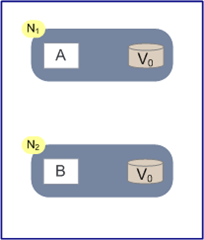

### 发展背景

#### 单一应用架构

   当网站流量很小时，只需一个应用，将所有功能都部署在一起，以减少部署节点和成本。。

####垂直应用架构
  
  当访问量逐渐增大，单一应用增加机器带来的加速度越来越小，将应用拆成互不相干的几个应用，以提升效率。

#### 分布式服务架构
   
   当垂直应用越来越多，应用之间交互不可避免，将核心业务抽取出来，作为独立的服务，逐渐形成稳定的服务中心，使前端应用能更快速的响应多变的市场需求。

### 什么是分布式系统？
   
   《分布式系统原理和范型》一书中是这样定义分布式系统的：“分布式系统是若干独立计算机的集合，这些计算机对于用户来说就像是单个相关系统”。
   从进程角度看，两个程序分别运行在两台主机的进程上，它们相互协作最终完成同一个服务（或者功能），那么理论上这两个程序所组成的系统，也可以称作是“分布式系统”。
   当然，这个两个程序可以是不同的程序，也可以是相同的程序。如果是相同的程序，我们又可以称之为“集群”。所谓集群，就是将相同的程序，通过不断横向扩展，以提高服务能力的方式。
   
   分布式和微服务
   
   微服务架构偏向于业务，比如可以将微服务按子业务、数据库、接口等维度拆分成不同的微服务
   分布式架构偏向于机器，目前，你可以说微服务架构都是分布式架构，因为目前大部分公司都是把每个服务单独部署的

### 分布式系统所遇到的挑战

#### 分布式session

##### Session粘滞
    
   即粘性Session、当用户访问集群中某台机器后，强制指定后续所有请求均落到此机器上
   
   使用场景：机器数适中、对稳定性要求不是非常苛刻
   
   优点：实现简单、配置方便、没有额外网络开销
   
   缺点：网络中有机器Down掉时、用户Session会丢失、容易造成单点故障
   
   方案：Nginx的ip_hash负载均衡方案

#####Session复制
    
   将一台机器上的Session数据广播复制到集群中其余机器上
   
   
   使用场景：机器较少，网络流量较小
   
   优点：实现简单、配置较少、当网络中有机器Down掉时不影响用户访问
   
   缺点：广播式复制到其余机器有一定廷时，带来一定网络开销
   
   方案：开源方案tomcat-redis-session-manager，暂不支持Tomcat8

##### 缓存集中式管理
    
   将Session存入分布式缓存集群中的某台机器上，当用户访问不同节点时先从缓存中拿Session信息
   
   使用场景：集群中机器数多、网络环境复杂
   
   优点：可靠性好
   
   缺点：实现复杂、稳定性依赖于缓存的稳定性、Session信息放入缓存时要有合理的策略写入
   
   方案：开源方案Spring Session，也可以自己实现，主要是重写HttpServletRequestWrapper中的getSession方法

#### 分布式配置中心
   
   在分布式系统中，一次构建、发布、上线是非常非常重的一个过程，它不像单机时代那样重启一台机器、一个进程就可以了，在分布式系统中，它涉及到将软件包(例如war)分发到可能超过几千台机器，然后将几千台机器上的应用进程一一重启，这么一个过程，超过2000台机器的一个应用一次完整的发布过程需要很长时间。
   
   那么如何在不停应用集群的情况下，调整整个集群的运行时的行为特征，是一个分布式系统必须回答的一个问题。从这个角度讲, 我们认为: 每一个大型分布式系统都应该有一个配置中心！
   
   我们平时常见的分布式系统的配置变更，诸如:
   
   • 线程池、连接池大小
   
   • 开关、限流配置
   
   • 数据源主备容灾切换
   
   • 路由规则
   
##### 开源解决方案
    
   1. disconf，百度开源，与spring集成的很好，有web管理，client只支持java。
    
   2. diamond，阿里开源，阿里内部应用广泛，由http server(nameservers), diamond-server ，web组成，diamond-server连接同一个mysql，数据同步通过mysql dump文件同步（同步效率？），支持订阅发布，client只支持java。
   
   3. doozer，已停止更新，设计倾向于实时的数据变更通知，数据全部放于内存，不会持久化文件。
   
   4. etcd，CoreOS开源，轻量级分布式key-value数据库，同时为集群环境的服务发现和注册而设计，它提供了数据TTL失效（通过TTL更新来判断机器下线，来避免一定的网络分区问题）、数据改变监视、多值、目录监听、分布式锁原子操作等功能，来管理节点状态。
   
   5. zookeeper，成熟的分布式配置解决方案。

#### 分布式事务
   
   分布式事务解决的用户最本质诉求是什么？数据一致。
   
   大中企业有一个共同的诉求是数据一致，几乎覆盖到各个行业。
   
   比如说零售行业，库存与出货的数据需要保持一致，出货量与库存数据不匹配，显而易见会出问题，拿到订单却没货了，或者有货却下不了订单。
   
   比如说金融行业，转账数据搞错了，A扣款了，B没加上，马上该用户投诉了；A没扣款，B却加上了，产生资损；又比如从总账户中买了基金、股票后余额不对了，等等，都会导致严重问题。
   
   随着互联网技术快速发展，数据规模增大，分布式系统越来越普及，采用分布式数据库或者跨多个数据库的应用在中大规模企业普遍存在，服务化也是广泛应用，由于网络的不可靠和机器不可靠，数据不一致问题很容易出现。
   
   数据一致性问题是必须解决的，在很多大企业多年前就已经成为突出问题，他们是怎么解决的？有这么几个典型方案：
   
   • XA事务方案
   
   • 柔性事务
   
   • 基于消息的最终一致
   
   • 业务补偿与人工订正

#### 分布式锁
   
   目前几乎很多大型网站及应用都是分布式部署的，分布式场景中的数据一致性问题一直是一个比较重要的话题。
   
   分布式的CAP理论告诉我们，任何一个分布式系统都无法同时满足一致性（Consistency）、可用性（Availability）和分区容错性（Partition tolerance），最多只能同时满足两项。
   所以，很多系统在设计之初就要对这三者做出取舍。在互联网领域的绝大多数的场景中，都需要牺牲强一致性来换取系统的高可用性，系统往往只需要保证“最终一致性”，只要这个最终时间是在用户可以接受的范围内即可。
   
   在很多场景中，我们为了保证数据的最终一致性，需要很多的技术方案来支持，比如分布式事务、分布式锁等。有的时候，我们需要保证一个方法在同一时间内只能被同一个线程执行。在单机环境中，Java中其实提供了很多并发处理相关的API，但是这些API在分布式场景中就无能为力了。也就是说单纯的Java Api并不能提供分布式锁的能力。所以需要需要针对分布式环境提供锁的能力。

##### 常见的分布式锁的实现方案
   
   1. mysql
   
   2. 内存数据库（redis、memcached等）
   
   3. zookeeper

#####CAP理论
   
   一个分布式系统最多只能同时满足一致性（Consistency）、可用性（Availability）和分区容错性（Partition tolerance）这三项中的两项。
   
#####Consistency 一致性
   
   一致性分为强一致性、弱一致性、最终一致性
    
   比如有一个Mysql集群（Mysql-A，Mysql-B），Mysql中由一份数据初始值为1，现在有一个用户User，User有两步操作：
   
   1. 修改Mysql集群中的数据为2；（假设，修改的是Mysql-A，Mysql-B中的更改需要同步）
   
   2. 读取Mysql集群中的数据；（假设，读取的是Mysql-B）
    如果：
    
    强制要求步骤2读取的时候，一定要读取的是2，不能读取到的是1，那么要求Mysql之间同步非常迅速或者在步骤2上加锁以等待数据同步完成，那么这种叫强一致性；
    允许步骤2读取的时候，可以读取的是1，那么这种叫弱一致性，其实就是不需要要一致；
    允许步骤2读取的时候，可以先读到1，过一段时间再读到2，那么这种叫最终一致性，就是可以等待一段时间才一致；
   
   CAP中的一致说的是强一致性
   
##### Availability 可用性
   
   可用性指服务一直可用，而且是正常响应时间。
   
   好的可用性主要是指系统能够很好的为用户服务，不出现用户操作失败或者访问超时等用户体验不好的情况。一个分布式系统，上下游设计很多系统如负载均衡、WEB服务器、应用代码、数据库服务器等，任何一个节点的不稳定都可以影响可用性。

##### Partition Tolerance分区容错性
   
   分区容错性指，即分布式系统在遇到某节点或网络分区故障的时候，仍然能够对外提供满足一致性和可用性的服务。
   
   分区容错性和扩展性紧密相关。在分布式应用中，可能因为一些分布式的原因导致系统无法正常运转。好的分区容错性要求能够使应用虽然是一个分布式系统，而看上去却好像是在一个可以运转正常的整体。比如现在的分布式系统中有某一个或者几个机器宕掉了，其他剩下的机器还能够正常运转满足系统需求，或者是机器之间有网络异常，将分布式系统分隔为独立的几个部分，各个部分还能维持分布式系统的运作，这样就具有好的分区容错性。
   
   简单点说，就是在网络中断，消息丢失的情况下，系统如果还能正常工作，就是有比较好的分区容错性。

##### CAP证明
   
   
   
   如上图，是我们证明CAP的基本场景，网络中有两个节点N1和N2，可以简单的理解N1和N2分别是两台计算机，他们之间网络可以连通，N1中有一个应用程序A，和一个数据库V，N2也有一个应用程序B2和一个数据库V。现在，A和B是分布式系统的两个部分，V是分布式系统的数据存储的两个子数据库。
   
   在满足一致性的时候，N1和N2中的数据是一样的，V0=V0。在满足可用性的时候，用户不管是请求N1或者N2，都会得到立即响应。在满足分区容错性的情况下，N1和N2有任何一方宕机，或者网络不通的时候，都不会影响N1和N2彼此之间的正常运作。
   
   
   
   如上图，是分布式系统正常运转的流程，用户向N1机器请求数据更新，程序A更新数据库Vo为V1，分布式系统将数据进行同步操作M，将V1同步的N2中V0，使得N2中的数据V0也更新为V1，N2中的数据再响应N2的请求。
   
   这里，可以定义N1和N2的数据库V之间的数据是否一样为一致性；外部对N1和N2的请求响应为可用行；N1和N2之间的网络环境为分区容错性。这是正常运作的场景，也是理想的场景，然而现实是残酷的，当错误发生的时候，一致性和可用性还有分区容错性，是否能同时满足，还是说要进行取舍呢？
   
   作为一个分布式系统，它和单机系统的最大区别，就在于网络，现在假设一种极端情况，N1和N2之间的网络断开了，我们要支持这种网络异常，相当于要满足分区容错性，能不能同时满足一致性和响应性呢？还是说要对他们进行取舍。
   
   
   
   假设在N1和N2之间网络断开的时候，有用户向N1发送数据更新请求，那N1中的数据V0将被更新为V1，由于网络是断开的，所以分布式系统同步操作M，所以N2中的数据依旧是V0；这个时候，有用户向N2发送数据读取请求，由于数据还没有进行同步，应用程序没办法立即给用户返回最新的数据V1，怎么办呢？
   
   有二种选择，
   
   第一，牺牲数据一致性，保证可用性。响应旧的数据V0给用户；
   
   第二，牺牲可用性，保证数据一致性。阻塞等待，直到网络连接恢复，数据更新操作M完成之后，再给用户响应最新的数据V1。
   
   这个过程，证明了要满足分区容错性的分布式系统，只能在一致性和可用性两者中，选择其中一个。

##### CAP权衡

   通过CAP理论及前面的证明，我们知道无法同时满足一致性、可用性和分区容错性这三个特性，那要舍弃哪个呢？
   我们分三种情况来阐述一下。

###### CA without P，保证可用性和一致性，不要分区容错性
   
   这种情况在分布式系统中几乎是不存在的。首先在分布式环境下，网络分区是一个自然的事实。因为分区是必然的，所以如果舍弃P，意味着要舍弃分布式系统。
   
   其实，在CAP理论中。C，A，P三者并不是平等的，CAP之父在《Spanner，真时，CAP理论》一文中写到：
   
    如果说Spanner真有什么特别之处，那就是谷歌的广域网。Google通过建立私有网络以及强大的网络工程能力来保证P，在多年运营改进的基础上，在生产环境中可以最大程度的减少分区发生，从而实现高可用性。
    
    Spanner是一个分布式数据库.
    
    从Google的经验中可以得到的结论是，无法通过降低CA来提升P。要想提升系统的分区容错性，需要通过提升基础设施的稳定性来保障。
    
    所以，对于一个分布式系统来说。P是一个基本要求，CAP三者中，只能在CA两者之间做权衡，并且要想尽办法提升P。

###### CP without A，保证一致性和分区容错性，牺牲可用性
   
   如果一个分布式系统不要求强的可用性，即容许系统停机或者长时间无响应的话，就可以在CAP三者中保障CP而舍弃A。
   
   一个保证了CP而舍弃了A的分布式系统，一旦发生网络故障或者消息丢失等情况，就要牺牲用户的体验，等待所有数据全部一致了之后再让用户访问系统。
   
   设计成CP的系统其实也不少，其中最典型的就是很多分布式数据库，他们都是设计成CP的。在发生极端情况时，优先保证数据的强一致性，代价就是舍弃系统的可用性。如Redis、HBase等，还有分布式系统中常用的Zookeeper也是在CAP三者之中选择优先保证CP的。

###### AP wihtout C，保证可用性和分区容错性，牺牲一致性
   
   要高可用并允许分区，则需放弃一致性。一旦网络问题发生，节点之间可能会失去联系。为了保证高可用，需要在用户访问时可以马上得到返回，则每个节点只能用本地数据提供服务，而这样会导致全局数据的不一致性。

###### 按场景选择合适的
   
   对于涉及到钱财这样不能有一丝让步的场景，C必须保证。网络发生故障宁可停止服务，这是保证CP，舍弃A。比如前几年支付宝光缆被挖断的事件，在网络出现故障的时候，支付宝就在可用性和数据一致性之间选择了数据一致性，用户感受到的是支付宝系统长时间宕机，但是其实背后是无数的工程师在恢复数据，保证数数据的一致性。
   
   对于其他场景，比较普遍的做法是选择可用性和分区容错性，舍弃强一致性，退而求其次使用最终一致性来保证数据的安全。这其实是分布式领域的另外一个理论--BASE理论

##### BASE理论
   
   BASE理论是对CAP理论的延伸，核心思想是即使无法做到强一致性（Strong Consistency，CAP的一致性就是强一致性），但应用可以采用适合的方式达到最终一致性。
   
   BASE是指基本可用（Basically Available）、软状态（ Soft State）、最终一致性（ Eventual Consistency）。
   
###### 基本可用（Basically Available）
   
   基本可用是指分布式系统在出现故障的时候，允许损失部分可用性，即保证核心可用。电商大促时，为了应对访问量激增，部分用户可能会被引导到降级页面，服务层也可能只提供降级服务。这就是损失部分可用性的体现。
###### 软状态（ Soft State）
   
   软状态是指允许系统存在中间状态，而该中间状态不会影响系统整体可用性。分布式存储中一般一份数据至少会有三个副本，允许不同节点间副本同步的延时就是软状态的体现。mysql replication的异步复制也是一种体现。

###### 最终一致性（ Eventual Consistency）
   
   最终一致性是指系统中的所有数据副本经过一定时间后，最终能够达到一致的状态。弱一致性和强一致性相反，最终一致性是弱一致性的一种特殊情况。
   
   由于BASE理论需要在一致性和可用性方面做出权衡，因此涌现了很多关于一致性的算法和协议：
    
    1. 两阶段提交
    
    2. 三阶段提交
    
    3. Paxos算法
    
    4. Zab协议
    
#### 分布式定时任务
   
   首先，我们要了解计划任务这个概念，计划任务是指由计划的定时运行或者周期性运行的程序。我们最常见的就是Linux的‘crontab’和Windows的‘计划任务’。
   
   那么什么是分布式定时任务，个人总结为：把分散的，可靠性差的计划任务纳入统一的平台，并实现集群管理调度和分布式部署的一种定时任务的管理方式。叫做分布式定时任务。
   
##### 单点定时任务的缺点:
   
   1. 功能相对简单，交互性差，任务部署效率低，开发和维护成本比较高，不能很好的满足各系统定时任务的管理和控制，尤其在多系统的环境下更加明显；
   
   2. 许多任务都是单机部署，可用性差；
   
   3. 任务跟踪和告警难以实现。

##### 分布式定时任务的优势：
   
   1. 通过集群的方式进行管理调度，大大降低了开发和维护成本；
   
   2. 分布式部署，保证了系统的高可用性，伸缩性，负载均衡，提高了容错；
   
   3. 可以通过控制台部署和管理定时任务，方便灵活高效；
   
   4. 任务都可以持久化到数据库，避免了宕机和数据丢失带来的隐患，同时有完善的任务失败重做机制和详细的任务跟踪及告警策略。

##### 流行的分布式定时任务框架
   
   1. Quartz：Quartz是Java领域最著名的开源任务调度工具。Quartz提供了极为广泛的特性如持久化任务，集群和分布式任务
   
   2. Elastic-job:Elastic-Job是ddframe中dd-job的作业模块中分离出来的分布式弹性作业框架。去掉了和dd-job中的监控和ddframe接入规范部分。该项目基于成熟的开源产品Quartz和Zookeeper及其客户端Curator进行二次开发。

#### 分布式系统问题的本质
   
   分布式各系统中间都需要进行网络通信，所以本来在单一架构中能保证的数据一致性，升级为分布式系统后数据的一致性就难以保证，而Zookeeper的诞生就可以解决这个本质问题：数据一致性，再加上zookeeper的其他特性还可以解决分布式锁，分布式定时任务等等场景问题。